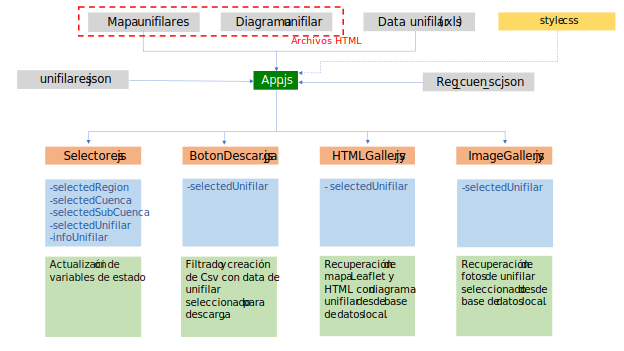

Uso plataforma unifilares

Julio 2023

Elaborado por:

Alicia Quijada Castro

para

{width="3.5083333333333333in"
height="2.2666666666666666in"}CENTRO DE INFORMACIÓN DE RECURSOS
NATURALES CIREN

30 de junio 2023

# Introducción

En este documento se describe el funcionamiento de la plataforma de
caudales, además de proporcionar pautas para su modificación y
mantenimiento. La plataforma se encuentra actualmente en estado de
desarrollo y se despliega en una dirección local dentro de una máquina
virtual de CIREN. Esto implica que solo los usuarios conectados a la red
interna de CIREN tienen acceso a ella.

Tras realizar pruebas con distintos lenguajes de programación y explorar
diversas librerías, se ha tomado la decisión de utilizar la librería
React de JavaScript. React ha demostrado ser una opción altamente
conveniente para la implementación de elementos web, siendo tanto
sencillo de utilizar como eficiente en términos de carga de contenidos.

## ¿Qué es React?

React es una librería de JavaScript de código abierto que se utiliza
para el desarrollo de aplicaciones web. Su enfoque principal radica en
la creación de componentes reutilizables para la construcción de nuevas
aplicaciones web.

La principal ventaja de utilizar React es su eficiencia en el consumo de
recursos en comparación con otras opciones que se consideraron
previamente en el proyecto. Esto se logra mediante la creación de una
representación virtual del DOM (Document Object Model) en la memoria y
la actualización selectiva de los elementos que necesitan ser
modificados cuando ocurre algún cambio en la plataforma. Por ejemplo, al
hacer clic en un selector, solo se actualizarán los elementos
específicos que han sido afectados por dicho cambio, evitando así una
carga innecesaria en el navegador.

Para obtener más información, se puede visitar la documentación oficial
en la página https://react.dev/.

# Arquitectura de la plataforma

En la Figura 2‑1 se presenta la arquitectura actual de la plataforma,
cabe destacar que esta versión se encuentra en desarrollo y aún no está
disponible para su uso general en producción.

{width="6.5in" height="3.65625in"}

Figura 2‑1. Arquitectura Plataforma (en desarrollo)

Las cinco principales fuentes de información que alimentan el código
general de la aplicación están representadas en gris.

En amarillo, se muestra el archivo style.css, que es responsable del
estilo de la plataforma web.

Los componentes que generan partes del código HTML se encuentran en
color naranja. Estos componentes se importan en el archivo app.js y
reciben variables de estado[^1] como inputs, las cuales pueden ser
actualizadas o utilizadas para crear nuevos elementos.

Las variables de estado, creadas en el archivo app.js, se muestran en
color celeste. Estas variables son utilizadas como inputs por los
componentes para actualizarlas o generar nuevos elementos.

En verde claro, se indica la acción que realizan los componentes, que
puede ser la actualización de las variables de estado recibidas o la
creación de nuevos elementos para renderizar dentro de la aplicación
web.

El archivo app.js, representado en verde oscuro, importa todas las
fuentes de información y realiza el enlace con el archivo style.css.
Aquí se crean las variables de estado y se importan los componentes que,
a su vez, reciben las variables de estado como props para actualizarlas
o crear nuevos elementos.

## Fuentes de información

Las fuentes de información se encuentran representadas en color gris en
la Figura 2‑1.

A continuación, se detallan las cinco fuentes de información utilizadas
por la aplicación, todas ellas interrelacionadas mediante códigos,
permitiendo realizar cruces de datos y obtener información completa del
unifilar seleccionado.

### Unifilares.json

El archivo unifilares.json es un archivo que contiene información de los
unifilares disponibles en la plataforma. Este contiene los siguientes
campos:

  -----------------------------------------------------------------------
  **Campo**               **Tipo**              **Descripción**
  ----------------------- --------------------- -------------------------
  id                      Int                   Identificador para
                                                relacionar con otros
                                                archivos de base de
                                                datos.

  codregion               Float                 Código de la región donde
                                                se encuentra el sistema.

  COD_CUEN                String                Código de la cuenca donde
                                                se encuentra el sistema.

  NOM_CUEN                Float                 Nombre de la cuenca donde
                                                se encuentra el sistema.

  COD_SUBC                String                Código de la cuenca donde
                                                se encuentra el sistema.

  Unifilar                String                Nombre del sistema
                                                unifilar

  Aux_Label               Int                   Etiqueta auxiliar
                                                utilizada como "*value*"
                                                del selector de unifilar

  Fuente_Hidrica          String                Fuente hídrica principal
                                                del sistema.

  Caudal_acc              Int                   Caudal total conocido del
                                                sistema

  Unidad                  string                Unidad en que se
                                                encuentra el valor
                                                "caudal_acc", puede ser
                                                L/s o acciones.
  -----------------------------------------------------------------------

Este archivo es generado a partir mediante un código Python, el cual se
describe en la sección 3.1 Base unifilares.json.

### Reg_cuen_sc.json

El archivo reg_cuen_sc.json es un componente vital que establece las
relaciones entre regiones, cuencas y subcuencas. Es importante tener en
cuenta que la división política y hídrica no siempre coinciden, lo que
significa que una cuenca puede estar presente en dos regiones
diferentes.

Dentro de los campos incluidos en el archivo, los principales son los
siguientes:

  -----------------------------------------------------------------------
  **Campo**               **Tipo**              **Descripción**
  ----------------------- --------------------- -------------------------
  COD_CUEN                Int                   Código de la cuenca

  NOM_CUEN                String                Nombre de la cuenca

  COD_SUBC                Int                   Código de la subcuenca

  NOM_SUBC                String                Nombre de la subcuenca

  codregion               Int                   Código de la región

  Region                  String                Nombre de la región
  -----------------------------------------------------------------------

### Data unifilar

Los archivos de Data unifilar son archivos Excel que contienen
información específica de un unifilar particular. Cada archivo recibe el
nombre correspondiente al unifilar que representa; por ejemplo, el
unifilar del Río Lontué se nombra \"Rio Lontue.xlsx\" y se guarda dentro
de la carpeta de la cuenca a la que pertenece, en este caso, la cuenca
del Río Mataquito.

Estos archivos son utilizados para crear los diagramas unifilares y
permiten que los usuarios descarguen la información desde la plataforma.

Para generar los diagramas unifilares, se ha desarrollado un código en
lenguaje Python que emplea la librería Sankey de Plotly, la cual
facilita la representación de diagramas de flujo. Cada curso de agua ya
sea río, estero, canal u otro, se representa mediante un nodo de inicio,
un enlace y un nodo final. Además, el ancho del enlace se define según
el caudal o número de acciones en la red, lo que permite una
visualización clara y significativa de la información hidrológica.

En el archivo, cada fila representa un curso de agua presente en el
sistema, siendo el primero de ellos siempre corresponde a la fuente
hídrica. Este tiene los siguientes campos:

  -----------------------------------------------------------------------
  **Campo**               **Tipo**              **Descripción**
  ----------------------- --------------------- -------------------------
  ID                      Int                   ID único del canal para
                                                la red

  Source                  Int                   Representa el ID de la
                                                fuente desde la cual el
                                                canal extrae o devuelve
                                                agua. Este campo
                                                establece una relación
                                                con la fuente hídrica
                                                asociada.

  Value                   Int                   Indica el caudal o número
                                                de acciones asociado al
                                                canal o curso de agua.
                                                Dependerá de la unidad
                                                especificada en el
                                                siguiente campo.

  Unit                    String                Define la unidad
                                                utilizada para expresar
                                                el valor en el campo
                                                \"Value\". Puede ser
                                                \"L/s\" o \"acciones"

  Label                   String                Contiene el nombre del
                                                canal o curso de agua.

  Ribera                  String                Indica desde qué ribera
                                                el canal extrae o
                                                devuelve agua.

  Tipo                    String                Especifica si el canal es
                                                de extracción o
                                                devolución de agua. Los
                                                valores posibles son
                                                \"extrae\" o
                                                \"devuelve\".
  -----------------------------------------------------------------------

Un ejemplo de este archivo se muestra en la Figura 2‑1:

{width="6.5in" height="4.177083333333333in"}

Figura 2‑2. Ejemplo archivo \"Estero Rio Seco.xlsx\"

### Mapa unifilares

Los mapas unifilares son archivo HTML generados mediante Python
utilizando la librería Folium. Independiente del unifilar al que
representen, estos mapas se nombran como "mapa.html".

En la Figura 2‑3 se muestra un ejemplo de este archivo.

{width="6.5in" height="3.145138888888889in"}

Figura 2‑3. Ejemplo archivo \"mapa.html\"

En la sección 3.3 Mapa unifilares HTML se detalla el proceso para
generar estos mapas utilizando la librería Folium.

### Diagramas unifilares

Los diagramas unifilares son archivos HTML generados mediante Python
utilizando la librería Sankey. Independientemente del unifilar al que
representen, estos diagramas se nombran como \"unifilar.html\".

La base para la creación de este archivo corresponde al archivo Excel
\"Data unifilar\", que contiene la información específica de cada curso
de agua en el sistema.

En la Figura 2‑4 se muestra un ejemplo de este archivo.

{width="6.5in" height="3.109722222222222in"}

Figura 2‑4. Ejemplo archivo \"unifilar.html\"

En la sección 3.2 Diagramas unifilares HTML se detalla el proceso para
generar estos diagramas unifilares digitalizados utilizando la librería
Sankey de Plotly.

## App.js 

App.js es un archivo JavaScript que sirve como la base de la aplicación.
En este archivo, se gestionan las conexiones entre los componentes, las
bases de datos y el archivo de estilo (style.css). Además, se escribe el
código HTML general para la aplicación.

Dentro de App.js, se define una función general donde se utilizan los
componentes y fuentes de información que han sido importados, y se crean
nuevas variables para su uso en la aplicación.

Este archivo juega un papel crucial en la definición de las variables de
estado, las cuales luego se entregan como props a los distintos
componentes. Estas variables de estado son dinámicas y reactivas a los
cambios que se producen en la pantalla de la aplicación. Se definen como
arreglos de la siguiente manera:

const \[nombreVariable, setNombreVariable\] = useState(valor inicial)

Para iniciar estas variables se utiliza el *Hook* useState, en el cual
se indica entre paréntesis el valor inicial que será actualizado con la
función de actualización setNombreVariable.

Gracias a esta funcionalidad de React, la aplicación puede responder a
eventos y cambios en tiempo real, lo que permite una interacción
dinámica y una experiencia más fluida para los usuarios. El uso de las
variables de estado es esencial para mantener la integridad y la
sincronización de los datos en la aplicación, asegurando que los
componentes siempre muestren la información más actualizada.

{width="6.5in"
height="1.7604166666666667in"}

Figura 2‑5. Definición de variables de estado

Como se puede ver en la Figura 2‑5 las variables de estados utilizadas
en esta aplicación son:

1.  selectedRegion

2.  selectedCuenca

3.  selectedSubCuenca

4.  selectedUnifilar

5.  resetButtonClicked

6.  infoUnifilar

El retorno de la función en App.js contiene un código HTML modificado
que integra los componentes junto con sus respectivos props, y otros
elementos necesarios para la interfaz de la aplicación. Esta estructura
se mantiene a través de divs y clases de HTML para mantener una
organización y presentación adecuadas, esto se puede ver en la Figura
2‑6.

Los componentes se utilizan con los valores de las variables de estado
asignados como props, lo que permite que los componentes reaccionen a
los cambios en estas variables y muestren la información correspondiente
en la interfaz. La estructura de divs y clases de HTML asegura una
maquetación coherente y facilita la aplicación de estilos CSS para
lograr una apariencia visual atractiva y consistente.

{width="6.5in"
height="3.9923611111111112in"}

Figura 2‑6. Retorno de función App

## Componentes

Los componentes son piezas fundamentales de las aplicaciones React,
estos permiten dividir en código en piezas manejables reutilizables.
Estos componentes son conceptualmente funciones JavaScript que reciben
inputs (*props*) y retornan elementos React[^2].

Los componentes se muestran en la Figura 2‑1 en cuadros de color
naranjo. Para la plataforma de unifilares se utilizaron los siguientes
componentes:

1.  Selectores.js

2.  BotonDescarga.js

3.  HTMLGallery.js

4.  ImageGallery.js

Todos estos componentes son importados dentro del archivo principal
app.js (ver Figura 2‑7) y luego son utilizados dentro del return de la
función, como se mostró en la sección anterior. La importación y uso de
estos componentes permite modularizar el código, facilitar su
mantenimiento y promover la reutilización de funcionalidades en
diferentes partes de la aplicación.

Al utilizar componentes, se mejora la estructura general del proyecto y
se hace más fácil la incorporación de nuevas características o la
modificación de funcionalidades existentes sin afectar al resto de la
aplicación.

{width="6.5in"
height="1.8368055555555556in"}

Figura 2‑7. Importación de componentes

### Selectores.js

El componente Selectores.js tiene la responsabilidad de crear las cajas
de selección (elementos HTML) para la región, cuenca, subcuenca y
unifilares y también de actualizar las variables de estado que recibe
como props.

Este componente recibe las siguientes variables de estado como props:

1.  \[selectedRegion, setSelectedRegion\]

2.  \[selectedCuenca, setSelectedCuenca\]

3.  \[selectedSubCuenca, setSelectedSubCuenca\]

4.  \[selectedUnifilar, setSelectedUnifilar\]

5.  \[infoUnifilar, setInfoUnifilar\]

En la plataforma web las variables selectedRegion, selectedCuenca,
selectedSubCuenca y selectedUnifilar están relacionadas entre sí. En
este componente se escriben las funciones que permiten realizar los
filtros para definir las opciones que se mostrarán según las selecciones
del usuario.

Por ejemplo, si el usuario selecciona la región del Maule, las opciones
mostradas en las cajas de selección para cuencas, subcuencas y
unifilares corresponderán únicamente a elementos de la región del Maule.
Por el contrario, si el usuario no realiza ninguna selección, todas las
cajas mostrarán todas las opciones disponibles.

###  BotonDescarga.js

El componente BotonDescarga.js recibe como entrada la variable
selectedUnifilar y busca dentro de la base de datos el archivo Excel
correspondiente para descargarlo. Además, este componente crea un botón
HTML con funciones onClick para iniciar la descarga del archivo y
disabled para mantener el botón deshabilitado mientras no haya un
unifilar seleccionado.

Al recibir la variable selectedUnifilar, el componente utiliza esta
información para buscar y acceder al archivo Excel correspondiente en la
base de datos de la plataforma. Una vez que se identifica el archivo
correcto, se habilita el botón con la función onClick, que inicia la
descarga del archivo al ser seleccionado por el usuario, este último
atributo (disabled) se utiliza para mantener el botón deshabilitado
mientras no haya un unifilar seleccionado. Esto asegura que el usuario
solo pueda descargar el archivo cuando haya realizado una selección
válida, evitando acciones innecesarias o resultados no deseados.

### HTMLGallery.js

El componente HTMLGallery.js también recibe como entrada la variable
selectedUnifilar y busca dentro de la base de datos dos archivos HTML:
uno con el mapa y otro con el diagrama unifilar. Ambos archivos fueron
generados previamente mediante Python y guardados dentro de la base de
datos local de la plataforma. La metodología utilizada para generar
estos archivos se describe en las secciones 3.2 y 3.3.

Este componente tiene la función de crear dos iframes para insertar
estos elementos HTML en la plataforma, pero solo lo hace si
selectedUnifilar no está vacío.

El uso de iframes permite la incorporación de contenido externo, en este
caso, los archivos HTML generados previamente. Al recibir la variable
selectedUnifilar, el componente verifica si esta variable contiene
información (es decir, si hay un unifilar seleccionado). En caso
afirmativo, se procede a mostrar el contenido de los dos archivos HTML
que contienen el mapa y el diagrama unifilar correspondientes al
unifilar seleccionado.

### ImageGallery.js

El componente ImageGallery.js, al igual que los dos componentes
anteriores, recibe como entrada la variable selectedUnifilar y busca
dentro de la base de datos las fotografías del sistema hidrológico.
Estas fotografías pueden incluir imágenes de la fuente hídrica y de los
canales presentes en el unifilar seleccionado.

Para la implementación de la galería de imágenes, este componente
utiliza el componente específico \"Carousel\" de React, que permite
presentar una secuencia de imágenes de forma interactiva y dinámica.

Al recibir la variable selectedUnifilar, el componente busca las
fotografías relacionadas con el unifilar seleccionado en la base de
datos. Una vez obtenidas las imágenes pertinentes, se crea un iframe que
contiene el \"Carousel\" de React, que se utiliza para mostrar las
fotografías en una presentación visual atractiva.

# Información generada con Python

El desarrollo de la plataforma web requirió la realización de tres
procesos fundamentales, los cuales se detallan en las siguientes
secciones.

## Base unifilares.json

El archivo unifilares.json es un diccionario que contiene la información
general de los diagramas unifilares disponibles en la plataforma. El
archivo puede ser modificado directamente en un editor de texto para
agregar nuevos campos o puede ser modificado desde un archivo Excel y
luego convertirlo a formato .json.

El archivo Excel se muestra en la Figura 3‑1. Ambos contienen los mismos
campos, lo que permite una fácil transición entre ambos formatos.

{width="6.5in" height="0.6965277777777777in"}

Figura 3‑1. Archivo Excel base para generación de archivo
unifilares.json

Es relevante mencionar que los campos COD_CUEN y COD_SUBC corresponden a
los códigos utilizados por la Dirección General de Aguas (DGA). Además,
los campos Caudal_ac y Unidad tendrán un valor de -99 si no existe
información disponible para ellos.

Para convertir el archivo Excel en formato .json, se puede utilizar el
código \"df_to_dict.py\" disponible en la carpeta del proyecto. Este
código permitirá realizar la transformación de manera sencilla y
automática, lo que agiliza el proceso de actualización y modificación de
la información contenida en el archivo unifilares.json[^3].

## Diagramas unifilares HTML

En la aplicación web, el componente HTMLGallery realiza una búsqueda de
archivos HTML con los diagramas unifilares según las opciones
seleccionadas por el usuario. Estos archivos fueron previamente
generados utilizando la librería Sankey de Plotly en Python.

Para crear el archivo HTML del diagrama unifilar, es necesario tener
organizada la información de cada unifilar en un archivo Excel, que
también es utilizado para que el usuario pueda descargar la información
del unifilar (sección 2.1.3 Data unifilar). El código Python encargado
de generar el archivo HTML utiliza la clase **Rib**, que contiene los
métodos necesarios para leer y organizar la información del archivo Data
unifilar. La librería Sankey de Plotly recibe dos diccionarios: uno para
nodos y otro para enlaces (links). Estos diccionarios permiten definir
las características de diseño del diagrama, como colores, espaciado,
etiquetas, ancho de los enlaces, entre otros.

El diagrama unifilar resultante contiene dos nodos por cada curso de
agua, los cuales se conectan mediante un link. Además, se generó un nodo
extra por cada curso de agua, situado sobre la fuente hídrica, para
generar el efecto visual de unión de los canales desde o hacia la fuente
principal. Un nodo extra puede estar conectado a cualquiera de los dos
nodos pertenecientes al curso de agua, dependiendo de si el curso extrae
o devuelve agua a la fuente principal. Esto se muestra en la Figura 3.2.

{width="6.5in"
height="3.082638888888889in"}

Figura 3‑2. Ejemplo diagrama unifilar

En el caso de que el curso de agua a representar corresponda a un TUC,
se le asignará el nombre \"TUC\" y dentro de las etiquetas se enlistan
los nombres de los canales dependientes de este. El valor asignado en el
diccionario \"link\" para este curso, que definirá el ancho del enlace,
corresponde a la suma de los caudales de los canales dependientes. El
código Python identifica estos casos siempre que en la columna
\"source\" del archivo Excel se indique el ID del TUC, como se muestra
en la Figura 3‑3.

{width="6.5in" height="4.177083333333333in"}

Figura 3‑3. Ejemplo definición de TUCs en planilla Excel

Una vez completados todos los campos en el archivo Excel, este se debe
guardar y será importado como un DataFrame en Python. Con esta
información, se generará el archivo \"unifilar.html\", el cual debe ser
guardado en la carpeta correspondiente para su posterior importación en
la aplicación React.

Es importante mencionar que las direcciones de los archivos deben ser
modificadas según el diagrama unifilar a renderizar. Además, el código
es fácilmente iterable para renderizar más de un unifilar en cada
compilación, lo que permite mostrar varios diagramas unifilares en la
plataforma web, ampliando así la capacidad de análisis y visualización
de información hidrológica para el usuario.

## Mapa unifilares HTML

En la aplicación web, el componente HTMLGallery realiza una búsqueda de
archivos HTML con el mapa de la ubicación del sistema hidrológico a
representar, según las opciones seleccionadas por el usuario. Estos
archivos de mapa fueron previamente generados utilizando la librería
Folium de Python.

El código Python necesita dos archivos GeoJSON como entrada: el primero
contiene la información geográfica del río o fuente hídrica principal
del sistema, y el segundo contiene los canales o esteros derivados.
Estos archivos GeoJSON pueden ser generados utilizando el software QGIS.
Hasta el momento, no se ha creado un código que permita generar estos
archivos GeoJSON de manera automática debido a las discrepancias entre
los nombres de ríos, esteros y canales indicados en los diagramas
unifilares originales y los nombres indicados en los archivos shapefile
utilizados para la generación de los GeoJSON.

En el código se pueden definir las características de las líneas como el
color y grosor. Por ejemplo, se ha decidido mostrar en azul la red
principal y en rojo los canales derivados, todos en el mismo grosor,
como se indica en la Figura 3‑4.

{width="6.5in"
height="4.647916666666666in"}

Figura 3‑4. Ejemplo mapa HTML

El código generará un archivo llamado \"mapa.html\", que debe ser
guardado en la carpeta correspondiente para su posterior importación en
la aplicación React. Al igual que con el archivo \"unifilar.html\", las
direcciones de los archivos deben ser modificadas según el diagrama
unifilar a renderizar. Además, el código es fácilmente iterable para
renderizar más de un unifilar en cada compilación, lo que permite
mostrar varios mapas unifilares en la plataforma web.

# Aplicación React

Para el desarrollo local de una aplicación es necesario instalar
Node.js, una vez instalado se debe generar un nuevo proyecto React con
el comando **npx create-react-app my-app**, donde "my-app" es el nombre
de la aplicación[^4].

Este comando instalará todas las dependencias básicas necesarias para la
aplicación React y generará los siguientes archivos y carpetas:

1.  package.json: Es un archivo que contiene metadatos del proyecto,
    como el nombre, versión, dependencias, URL de inicio, descripción,
    entre otros.

2.  node_modules: Es una carpeta que contiene los módulos necesarios e
    instalados para la aplicación. Esta carpeta es creada y mantenida
    por Node.js y no debe modificarse directamente.

3.  src: Es la carpeta base de la aplicación donde se encuentran los
    archivos JavaScript y donde se realizará la mayor parte del
    desarrollo. Aquí se ubicará el archivo app.js y otros archivos
    JavaScript necesarios para la lógica de la aplicación.

4.  public: Es una carpeta con archivos estáticos de la aplicación, como
    el archivo index.html que sirve como punto de entrada de la
    aplicación.

Dentro de la carpeta src, para este proyecto en particular, se han
generado dos carpetas adicionales:

1.  Data: Esta carpeta almacena los archivos JSON y otros datos que se
    utilizan en la aplicación, como el archivo unifilares.json y
    reg_cuenc_sc.json mencionados anteriormente.

2.  Components: Esta carpeta contiene los componentes de la aplicación,
    como Selectores.js, BotonDescarga.js, HTMLGallery.js, y
    ImageGallery.js que fueron mencionados previamente en la sección
    2.3.

La estructura de la carpeta src y sus contenidos se pueden ver en la
Figura 4‑1.

{width="4.239583333333333in"
height="6.229166666666667in"}

Figura 4‑1. Estructura carpeta src

La carpeta public aloja los archivos estáticos que no serán procesados
por React. Para este proyecto se ha utilizado la estructura de carpetas
que se muestra en la Figura 4‑2.

{width="4.375in" height="3.90625in"}

Figura 4‑2. Estructura carpeta Public

# Ejecución la aplicación

Una vez generados todos los archivos necesarios, mencionados
anteriormente, se puede ejecutar la aplicación para probar su
funcionamiento. Para ello, se deben seguir los siguientes pasos:

1.  Abrir una terminal en el sistema operativo

2.  Navegar hacia la ubicación de la carpeta del proyecto React

3.  Escribir el comando "npm start"

Este comando iniciará el servidor de desarrollo y compilará la
aplicación. La terminal mostrará información sobre la compilación y la
dirección local en la que se está ejecutando la aplicación, como se
indica en la Figura 5‑1.

{width="6.5in" height="0.27569444444444446in"}

{width="6.5in"
height="1.3340277777777778in"}

Figura 5‑1. Terminal al iniciar la aplicación en desarrollo

Luego al ingresar a la dirección <http://localhost:3000/> se mostrará la
página inicial de la aplicación (ver Figura 5‑2).

{width="6.5in"
height="3.0965277777777778in"}

Figura 5‑2. Página inicial de aplicación en desarrollo

Desde este punto, la aplicación estará en ejecución y podrá interactuar
con ella a través del navegador. Cualquier cambio realizado en el código
fuente de la aplicación se reflejará automáticamente en el navegador
gracias al servidor de desarrollo, lo que facilita el proceso de
desarrollo y depuración.

[^1]: Para obtener información sobre las variables de estado, consultar
    la documentación disponible en
    https://es.react.dev/learn/state-a-components-memory

[^2]: Para más información de componentes React visitar
    https://react.dev/learn/your-first-component

[^3]: Se deben verificar las direcciones de los archivos

[^4]: Existen otros métodos para crear una nueva aplicación React.
    Visitar https://es.react.dev/learn/start-a-new-react-project
